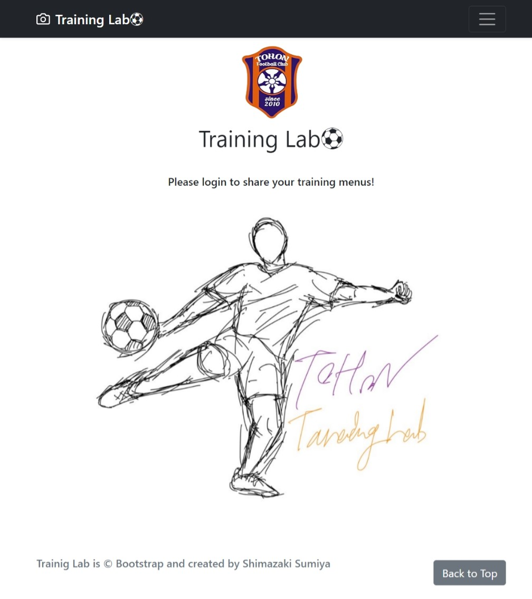

# サッカー練習共有アプリ「Training Lab」
- https://traininglab.pythonanywhere.com/
 

## 1. 概要
python Djangoを用いてwebアプリケーションの開発を実践する．  
サッカーコーチをしている中、コーチ間の練習内容や指導内容などの情報共有が不足していることに課題を感じ、サッカー練習共有アプリ「Training Lab」を開発．

## 2. 環境
- 使用言語：python
- フレームワーク：django
- 開発環境：vscode
- サーバー：pythonanywhere

## 3. システム構成
以下システム構成図である.  
省略

## 4. 内容
機能一覧
- a
- b
- c

## 5．今後の計画
修正点＆追加すべき点としては次の通り
- 本番環境でパスワードリセットがエラーになってしまう（サーバーエラー505）
- 投稿お気に入り機能＆お気に入り一覧機能の追加
- 消去した投稿画像の完全消去
- いいね＆フォロー機能
- いいね＆日付ソート機能
- 検索にユーザー名とカテゴリをヒットさせる
- 投稿内容のテンプレート機能
- チームごとにログインできる機能
- 動画添付機能

## 6．参考文献
- Django4 Webアプリ開発 実装ハンドブック チーム・カルポ (著)  
https://www.amazon.co.jp/Django4-Web%E3%82%A2%E3%83%97%E3%83%AA%E9%96%8B%E7%99%BA-%E5%AE%9F%E8%A3%85%E3%83%8F%E3%83%B3%E3%83%89%E3%83%96%E3%83%83%E3%82%AF-%E3%83%81%E3%83%BC%E3%83%A0%E3%83%BB%E3%82%AB%E3%83%AB%E3%83%9D-ebook/dp/B09Y538JTY/ref=sr_1_8?adgrpid=117859579583&hvadid=664264519613&hvdev=c&hvqmt=e&hvtargid=kwd-1248732224304&hydadcr=1794_13625203&jp-ad-ap=0&keywords=python+django+%E6%9C%AC&qid=1689183460&sr=8-8

## 6．その他
webアプリとgithubに載っているソースコードは若干違いあり．
